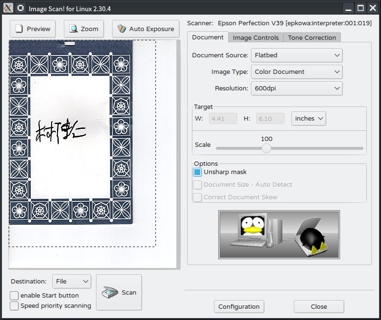

# Unofficial Snap Packaging for Image Scan! for Linux, version 2

<!--
	Use the Staticaly service for easy access to in-repo pictures:
	https://www.staticaly.com/
-->
 Icon of Image Scan! for Linux")

**This is the unofficial snap for Image Scan! for Linux**, *"A graphical
scanner utility for people that do not need all the bells and whistles
provided by several of the other utilities out there"*. It works on
Ubuntu, Fedora, Debian, and other major Linux distributions.

<!-- Uncomment and modify this when you are provided a snap status badge

-->

Published for  with 💝 by Snapcrafters

<!-- Uncomment and modify this when you have published the snap to the Snap Store
## Installation

([Don't have snapd installed?](https://snapcraft.io/docs/core/install))

### In a Terminal

    # Install the snap #
    sudo snap install --channel=edge --devmode iscan
    #sudo snap install --channel=beta iscan
    #sudo snap install iscan

    # Connect the snap to essential security confinement interfaces #
    ## (Proper reasoning for connecting _plug_name_) ##
    sudo snap connect iscan:_plug_name_

    # Connect the snap to optional security confinement interfaces #
    ## (Proper reasoning for connecting _plug_name_) ##
    sudo snap connect iscan:_plug_name_

    # Launch the application #
    iscan
    snap run iscan # If you have another existing installation

### The Graphical Way

-->

<!-- Uncomment when you have test results
## What is Working

* [A list of functionallities that are verified working]

## What is NOT Working...yet

Check out the [issue tracker](https://github.com/brlin-tw/iscan-snap/issues) for known issues.
-->

## Support
* Report issues regarding using this snap to the issue tracker:  
  <https://github.com/brlin-tw/iscan-snap/issues>
* You may also post on the Snapcraft Forum, under the `snap` topic category:  
  <https://forum.snapcraft.io/c/snap>
